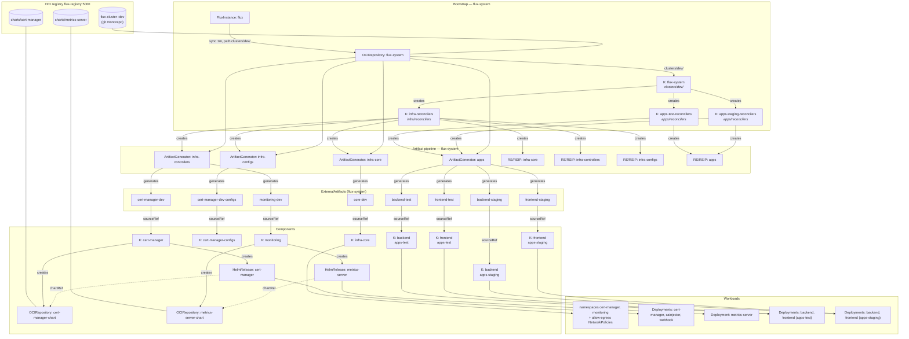

# Flux Cluster — GitOps Graph

Cluster: `kind-flux` (2 nodes, arm64, k8s v1.36.1) — Flux v2.9.4 via flux-operator v0.58.1,
synced from `oci://flux-registry:5000/flux-cluster` (`dev` tag).

## How it flows

1. **Source of truth** — one git monorepo published as the `flux-cluster:dev` OCI image; the FluxInstance syncs `clusters/dev/` every 1m.
2. **Bootstrap** — `K:flux-system` applies the FluxInstance, the `flux-vars` ConfigMap, and the 3 reconciler Kustomizations.
3. **Fan-out** — reconcilers create the 4 ArtifactGenerators and the ResourceSets/ResourceSetInputProviders; generators expand monorepo paths (`apps/{app}/envs/{env}`, `infra/components/{app}/...`, `infra/core/...`) into 14 per-app/env ExternalArtifacts.
4. **Delivery** — ResourceSets materialize a Kustomization per app/component, each sourcing its ExternalArtifact; app Kustomizations live in tenant namespaces (`apps-test`, `apps-staging`).
5. **Charts** — infra Kustomizations create the chart OCIRepositories and HelmReleases, which pull charts from the separate chart images.

## Notes

- All 12 Kustomizations and 2 HelmReleases are Ready; nothing failing or suspended.
- 6 `-prod` ExternalArtifacts (`backend-prod`, `frontend-prod`, `cert-manager-prod`, `monitoring-prod`, `cert-manager-prod-configs`, `core-prod`) are generated but have no consumers on this cluster — there is no `apps-prod` namespace or prod reconciler.
- HelmReleases are consumed via `chartRef`: `cert-manager` → `oci://flux-registry:5000/charts/cert-manager` (v1.21.1), `metrics-server` → `oci://flux-registry:5000/charts/metrics-server` (v3.14.0).
