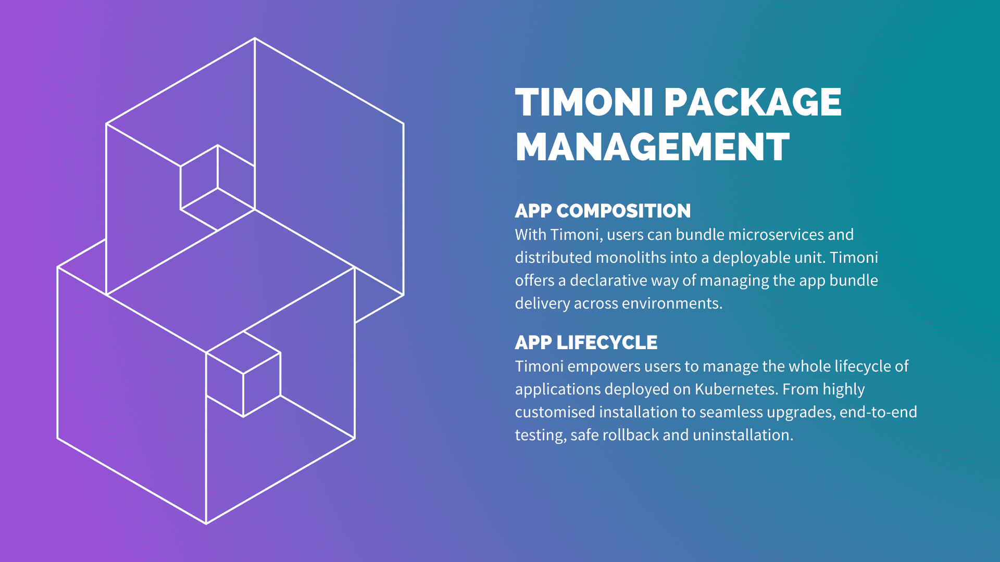
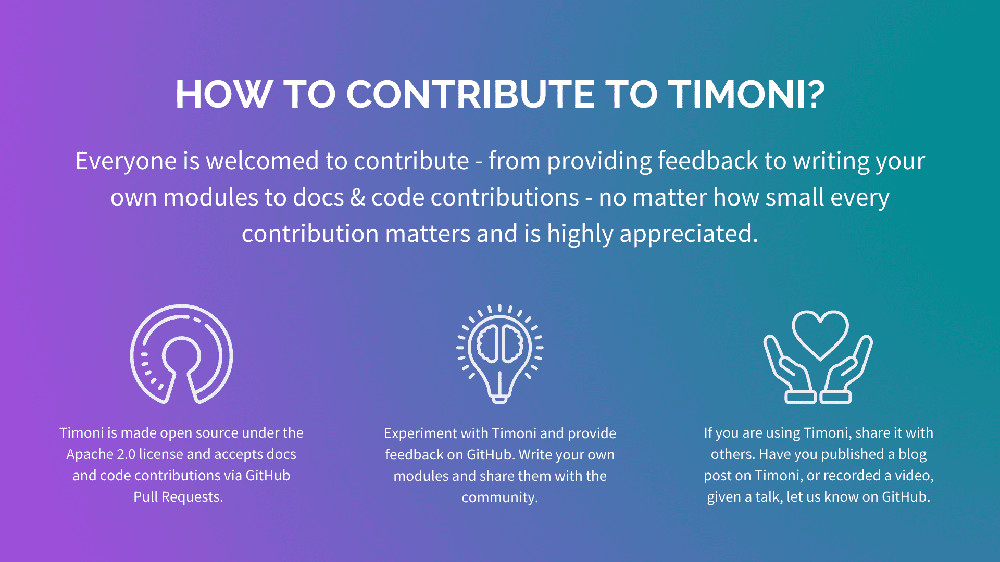

# Introducing Timoni - Next-Gen Package Manager for Kubernetes

I'm excited to formally introduce [Timoni](https://github.com/stefanprodan/timoni),
a personal project that I've started at the beginning of this year with the goal of
offering a better experience when creating, packaging and
delivering apps to Kubernetes.

Instead of using Go templates with YAML like Helm or layering YAML
like Kustomize, Timoni relies on [CUE](https://cuelang.org/)'s
type safety, code generation, and data validation features to
improve the UX of authoring Kubernetes configs.

<!-- more -->

