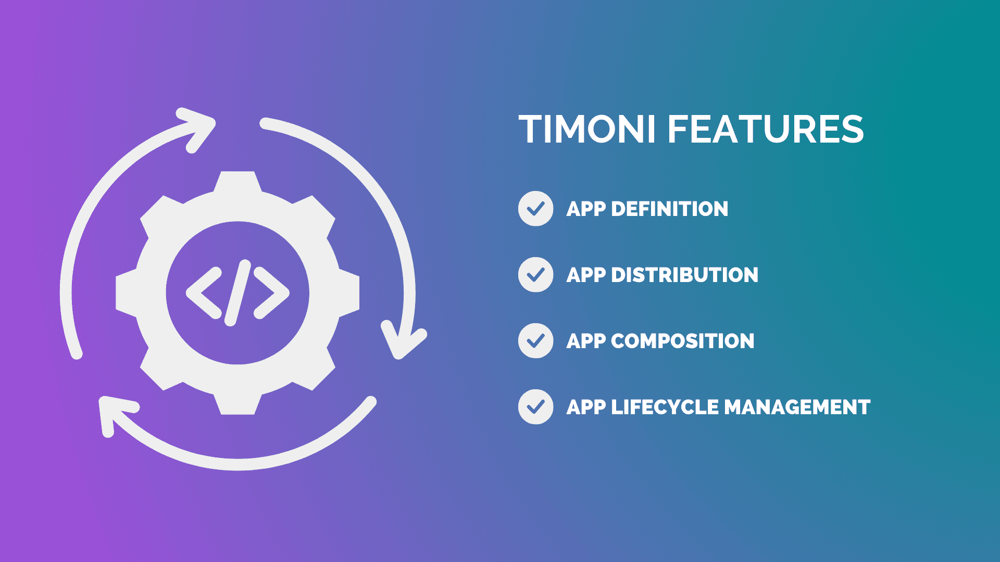
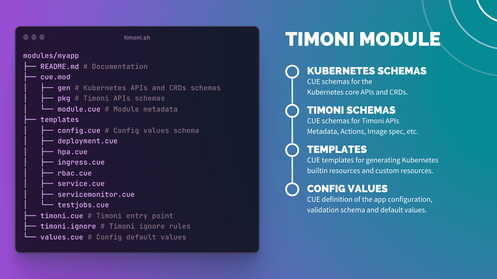
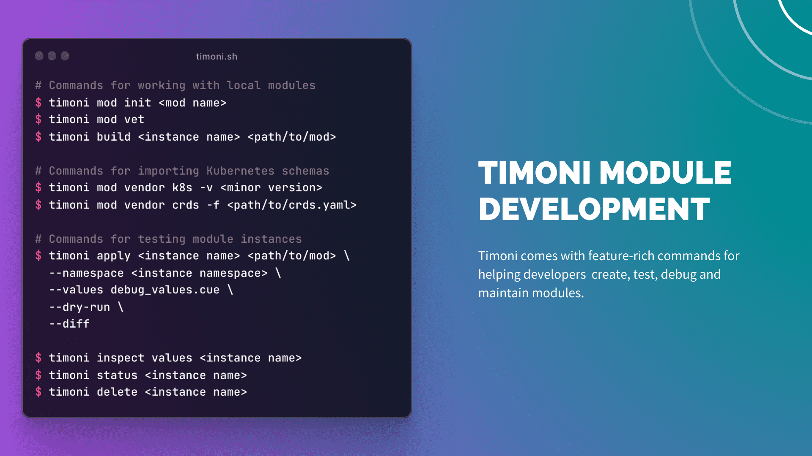
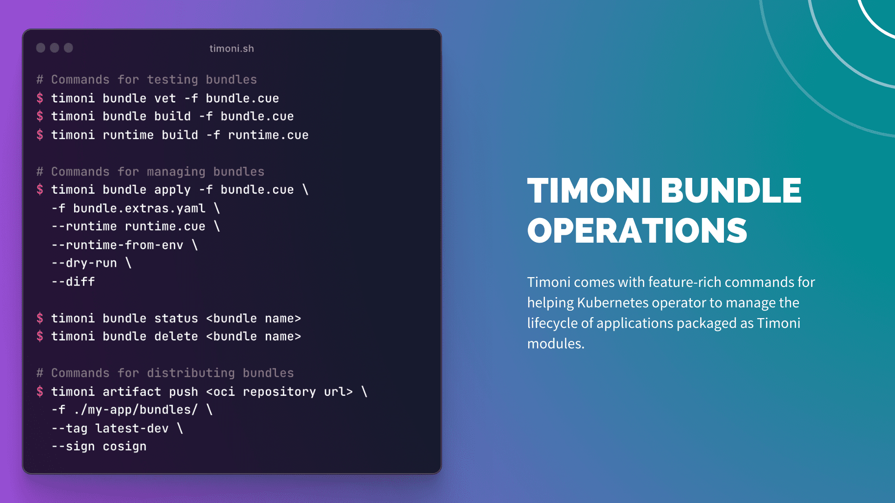
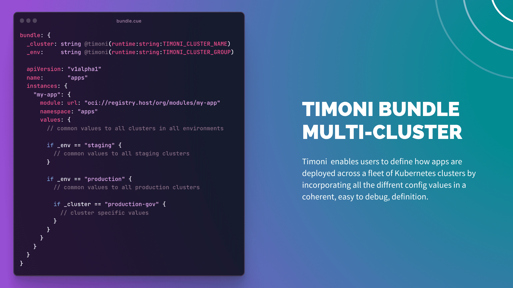

# Introducing Timoni - Next-Gen Package Manager for Kubernetes

I'm excited to formally introduce [Timoni](https://github.com/stefanprodan/timoni),
an open source project that I've started at the beginning of 2023, with the goal
of offering a better experience for creating, packaging and delivering apps to Kubernetes.

<!-- more -->

Timoni was born out of frustration from crafting Kubernetes YAMLs and especially Helm charts.
I’ve been a [Flux](https://fluxcd.io) maintainer for six years now, and while I enjoy building
software on top of Kubernetes, writing complex deployments using Helm templating never felt good.

In my quest to write less YAML, I’ve discovered [CUE](https://cuelang.org/), a brand-new language
with the promise of reducing boilerplate, while offering type checking and
validation for any kind of configuration.

I briefly looked at CUE in 2021, back then, their docs looked like an academic paper, and it threw me off.
Then in 2022, I was in Valencia at KubeCon talking to Flux users at the CNCF projects pavilion,
when someone mentioned how they migrated all their app definitions from Helm templates and Kustomize overlays to CUE. 
I’ve returned home and I started using CUE in anger, reading bits of their source code, unit tests,
issues and the tutorials created by [Tony](https://github.com/verdverm).

After some time, CUE really grew on me. I ended up creating a new
[Flux distribution](https://github.com/stefanprodan/flux-aio) with it,
and the whole experience was so much better than doing it with Helm templates.
But still, lots of things were missing, I could not share my CUE code with others,
unless they would fork my repo and make changes on their own.
Deploying the CUE generated objects required piping to kubectl in stages.
Validating Flux custom resources was less than ideal, the CUE schemas generated from the
Flux Go API packages where missing the kubebuilder constraints.
Despite all these limitations, I really enjoyed CUE’s expressiveness and guardrails.

Fast-forward to February 2023, I come up with a plan on how to overcome the usability
issues I faced while building the experimental Flux distribution. The plan was to develop
a tool with similar features to Helm, but with CUE as the templating engine,
OCI artifacts as the distribution method and with Kubernetes server-side apply
as the deployment engine. And so Timoni was born.

After nine months of working on the project in my spare time and with help
from other CUE enthusiasts, Timoni has become a feature-rich package manager,
capable of orchestrating the distribution and delivery of complex
applications across clusters and environments.

What follows is an overview of Timoni’s core concepts and features.

## Who is Timoni for?

**Software Makers** - Vendors, OSS maintainers and platform engineers who want to distribute cloud-native application to 
end-users.

**Kubernetes Users** - Developers and operators who want to customise and safely deploy OSS, own apps and 3rd party 
services to clusters.

## What is Timoni?

Timoni is a package manager solution made as a command line tool, built with Go for macOS, Linux and Windows.

Timoni incorporates the following technologies:

**CUE lang** - Instead of using Go templates with YAML like Helm or layering YAML like Kustomize, Timoni relies on 
CUE's type safety, code generation, and data validation features to improve the UX of authoring Kubernetes configs.

**OCI Artifacts** - Timoni relies on the Open Container Initiative (OCI) standards to package and distribute 
applications to container registries in the form of OCI artifacts.

**Kubernetes** - Timoni relies on the Kubernetes API server-side apply to detect and correct drift between the app's 
desired state and cluster state. Users can manage the lifecycle of Kubernetes controllers, including the upgrade of CRDs.
Software Vendors can import CRD schemas from YAML files and embed custom resources in their modules.

## What makes Timoni a package manager?

**App Definition and Distribution**

Timoni enables software vendors and OSS maintainers to define complex application deployments, packaged as Modules,
using type-safe Kubernetes templates and rich customisation options for end-users.

The app configuration packaged in a Module is distributed as an Open Container Initiative (OCI) artifact,
next to the app images, in a container registry.

Timoni Modules are semantically versioned, support immutability, and can be cryptographically signed.

**App Composition and Lifecycle Management**

With Timoni, users can bundle microservices and distributed monoliths into a deployable unit.
Timoni offers a declarative way of managing the app bundle delivery across environments.

Timoni empowers users to manage the whole lifecycle of applications deployed on Kubernetes.
From highly customised installation to seamless upgrades, end-to-end testing, safe rollback and uninstallation.

## What is a Timoni Module?

A Timoni module contains a set of CUE definitions and constraints organised into a CUE module with an opinionated structure.

A module accepts a set of values supplied by users, and outputs a set of Kubernetes objects that Timoni deploys on Kubernetes clusters.

Timoni comes with feature-rich commands for helping developers create, test, debug and maintain modules.

For an in-depth overview of Timoni's modules, see the documentation at [timoni.sh/module](https://timoni.sh/module).

Timoni comes with commands for distributing, signing, verifying and discovering app modules.

For an in-depth overview of Timoni's module distribution capabilities, see the documentation at
[timoni.sh/module-distribution](https://timoni.sh/module-distribution) and [timoni.sh/module-sign](https://timoni.sh/module-sign).

## What is a Timoni Bundle?

Timoni bundles offer a declarative way of managing the lifecycle of applications and their infra dependencies.

A Timoni bundle is a CUE file for defining a group of instances together with their values and module references.

Timoni comes with feature-rich commands for helping Kubernetes operator to install,
upgrade and test applications packaged as Timoni modules.

For an in-depth overview of Timoni's bundles, see the documentation at [timoni.sh/bundle](https://timoni.sh/bundle).

Timoni enables users to define how apps are deployed across a fleet of Kubernetes clusters by
incorporating all the different config values in a coherent, easy to debug, definition.

For an in-depth overview of Timoni's deployment capabilities and secrets management,
see the documentation at [timoni.sh/bundle-runtime](https://timoni.sh/bundle-runtime)
and [timoni.sh/bundle-secrets](https://timoni.sh/bundle-secrets).

## Is Timoni similar to Helm?

If you are familiar with Helm, a Timoni Module is the equivalent of a chart,
a Timoni Bundle is the equivalent of an umbrella chart, and a Timoni Instance is the equivalent of a Helm release.

While Timoni has similar concepts to Helm, the authoring UX and the operational model are very different.

**Performance Differences**

Timoni does not store copies of all applied resources in Kubernetes secrets, making it more performant when dealing with large deployments.

Timoni patches only the Kubernetes objects that have changed during upgrades, while Helm applies all manifests.
Making Timoni significant faster than Helm.

In general, Timoni is more efficient than Helm in terms of Kubernetes API resource usage.

For an in-depth comparison, please see [timoni.sh/comparison/#helm](https://timoni.sh/comparison/#helm).

## How to get started with Timoni?

Getting started with Timoni is easy, all you need is a Kubernetes cluster and a container registry
if you plan to create your own Timoni modules.

You can use GitHub Container Registry, DockerHub or a self-hosted Docker Registry, any OCI-compatible registry will do.

For running Kubernetes locally, you can use kind, k3s, k0s or any other distribution,
the only requirement is running Kubernetes v1.25 or a newer version.

Resources:
- [Timoni Get started guide](https://timoni.sh/quickstart/)
- [Timoni Installation guide](https://timoni.sh/install/)

## How to contribute to Timoni?

Timoni is made open source under the Apache 2.0 license and accepts docs and code
contributions via GitHub Pull Requests. For more information, please see the
[contributing guide](https://github.com/stefanprodan/timoni/blob/main/CONTRIBUTING.md) and the
[code of conduct](https://github.com/stefanprodan/timoni/blob/main/CODE_OF_CONDUCT.md).

Everyone is welcomed to contribute - from providing feedback to sharing your own modules to docs & code 
contributions - no matter how small every contribution matters and is highly appreciated.

## How can you help?

If Timoni feels interesting to you, please [give it a star](https://github.com/stefanprodan/timoni)
on GitHub to show your support!

If you are using Timoni in any capacity, on your home cluster or at work,
it would be really great if you could let me now in a
[comment on GitHub](https://github.com/stefanprodan/timoni/issues/245).

Any feedback is appreciated, feel free to
[contact me on Slack or social media](https://stefanprodan.com/portfolio/biography/).
