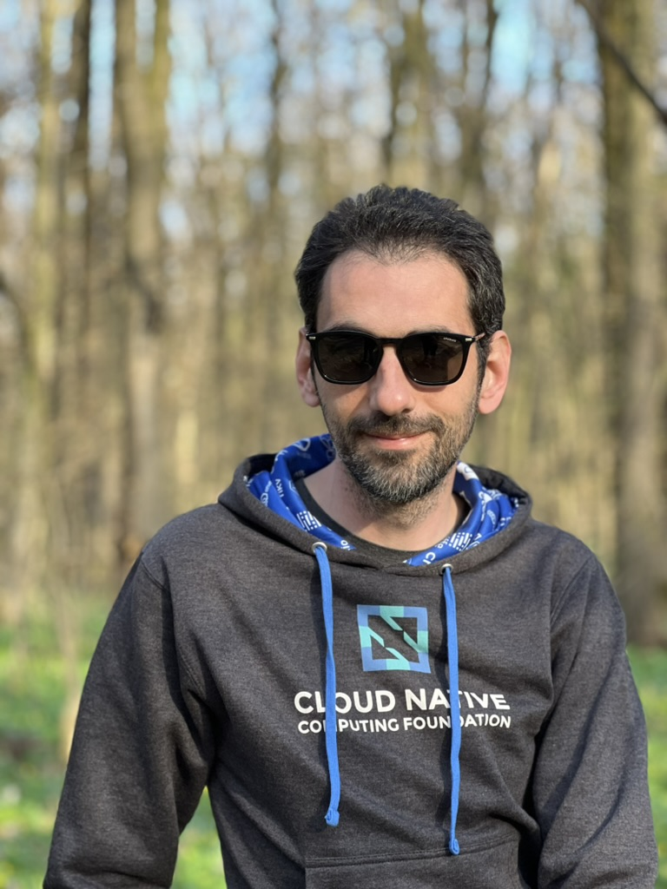

---
hide:
  - toc
---

# Biography

{ align=right width="250" }

Stefan is a Software Engineer and
an open source contributor to cloud-native projects.
He is the creator of Flagger the progressive delivery
operator for Kubernetes, and a core maintainer
of Flux CD, a [CNCF](https://cncf.io) graduated project.

In 2024, Stefan joined [ControlPlane](https://control-plane.io),
as a Principal Consultant, where he is working on expanding the company
security services portfolio to Flux and GitOps continuous delivery.

Between 2017 - 2023, Stefan worked as a Principal Engineer at Weaveworks,
where he was responsible for architecting and maintaining
Flux, Flagger and the GitOps Toolkit.

Before Weaveworks, he worked as a software architect
and a DevOps consultant, helping companies embrace DevOps and the SRE movement.
Stefan has over 15 years of experience with software development,
and he enjoys programming in Go and given talks about distributed systems.

## Contact

:fontawesome-brands-slack: [@stefanprodan](https://cloud-native.slack.com/team/ULPRMFH38) on cloud-native.slack.com

## Social

:fontawesome-brands-linkedin: [@stefanprodan](https://linkedin.com/in/stefanprodan)

:fontawesome-brands-square-x-twitter: [@stefanprodan](https://x.com/stefanprodan)

:fontawesome-brands-github: [@stefanprodan](https://github.com/stefanpordan)

:fontawesome-solid-rss: [stefanprodan.substack.com](https://stefanprodan.substack.com/)
